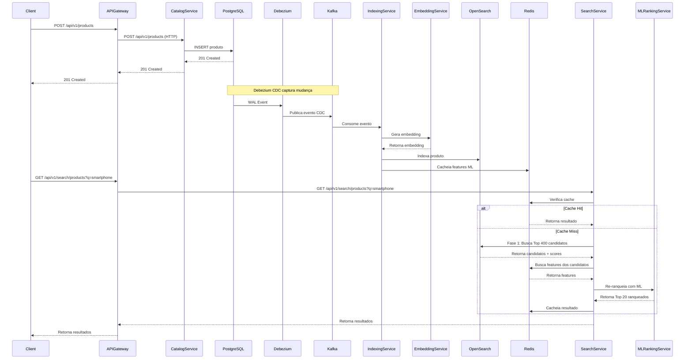
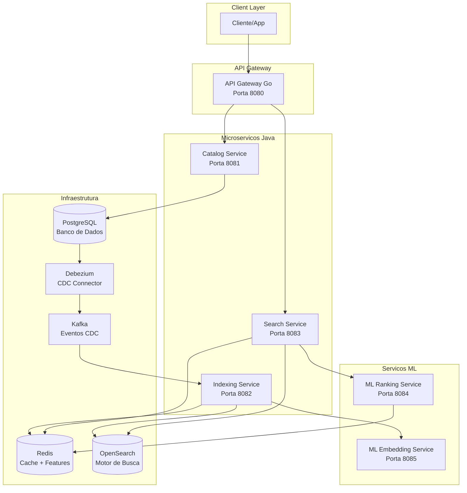

# Marketplace Search System

Sistema de busca inteligente para marketplace com arquitetura de microserviços, Machine Learning e indexação em tempo real via CDC.

## 🏗️ Arquitetura

O projeto segue **Arquitetura de Microserviços** com API Gateway para roteamento e serviços especializados:

```
marketplace-search-system/
├── api-gateway/          # 🚪 API Gateway - Roteamento de requisições
├── catalog-service/      # 📦 Catalog Service - CRUD de produtos
├── indexing-service/     # 🔍 Indexing Service - Indexação via Kafka CDC
├── search-service/       # 🔎 Search Service - Busca com ML ranking
├── ml-ranking-service/   # 🤖 ML Ranking Service - Re-ranking com ML
└── ml-embedding-service/ # 🧠 ML Embedding Service - Geração de embeddings
```

### Componentes

| Serviço | Porta | Descrição |
|---------|-------|-----------|
| **API Gateway** | 8080 | Roteia requisições para os microserviços |
| **Catalog Service** | 8081 | Gerencia produtos no PostgreSQL |
| **Indexing Service** | 8082 | Indexa produtos no OpenSearch via Kafka CDC |
| **Search Service** | 8083 | Realiza buscas no OpenSearch com ML ranking |
| **ML Ranking Service** | 8084 | Re-ranqueia produtos usando Machine Learning |
| **ML Embedding Service** | 8085 | Gera embeddings vetoriais para busca semântica |

## 🚀 Tecnologias

### Backend
- **Go 1.23+** - API Gateway (Gin Framework)
- **Java 17** + **Spring Boot 3.2.0** - Microserviços Java
- **Maven** - Gerenciamento de dependências Java
- **Arquitetura Hexagonal** - Separação de responsabilidades

### Busca e Indexação
- **OpenSearch 3.x** - Motor de busca principal
- **Apache Kafka 3.6.1** - Eventos e CDC em tempo real
- **Debezium 2.6.0** - Change Data Capture (CDC)

### Machine Learning
- **Python 3.11** - Serviços ML
- **FastAPI** - Framework web assíncrono
- **sentence-transformers** - Modelos de embedding
- **PyTorch** - Backend para modelos de ML

### Infraestrutura
- **PostgreSQL 15** - Banco de dados transacional
- **Redis 7** - Cache de alta performance e Feature Store
- **Docker Compose** - Ambiente de desenvolvimento
- **Prometheus** - Métricas
- **Grafana** - Visualização de métricas

## 📦 Funcionalidades

### ✅ Implementado
- [x] **Busca de Produtos** - Busca textual com filtros, ordenação e paginação
- [x] **Busca em 2 Fases** - Top 400 candidatos + ML ranking para Top 20
- [x] **Indexação Automática** - Eventos CDC via Kafka (Debezium)
- [x] **Indexação Assíncrona** - Processamento paralelo com ThreadPool
- [x] **Cache Inteligente** - Redis para consultas frequentes
- [x] **ML Ranking** - Re-ranking com 17 features usando modelo ML
- [x] **Embeddings Vetoriais** - Busca semântica com k-NN
- [x] **Feature Store** - Cache de features ML no Redis
- [x] **Métricas & Observabilidade** - Micrometer + Prometheus
- [x] **Arquitetura Hexagonal** - Preparada para microserviços
- [x] **API Gateway** - Roteamento centralizado com OpenAPI

### 🔄 Em Desenvolvimento
- [ ] **Dead Letter Queue** - Tratamento de erros persistentes
- [ ] **Circuit Breaker** - Resiliência para serviços downstream
- [ ] **Retry Automático** - Retry com backoff exponencial

### 📋 Roadmap
- [ ] **Analytics** - Métricas de busca e comportamento
- [ ] **A/B Testing** - Experimentação de relevância
- [ ] **Personalização Avançada** - Baseada em histórico do usuário
- [ ] **Modelo ML Treinado** - Substituir pesos fixos por modelo treinado

## 🛠️ Setup do Ambiente

### Pré-requisitos
- Go 1.23+ (para API Gateway)
- Java 17+ (para microserviços Java)
- Maven 3.8+
- Docker & Docker Compose
- Python 3.11+ (para serviços ML)

### 1. Clonar e Configurar

```bash
git clone <repository-url>
cd marketplace-search-system
```

### 2. Subir Infraestrutura

```bash
# Subir todos os serviços (PostgreSQL, Redis, OpenSearch, Kafka, etc.)
docker-compose up -d

# Verificar se os serviços estão rodando
docker-compose ps
```

### 3. Compilar e Executar

```bash
# Compilar e executar o API Gateway (Go)
cd api-gateway
go run cmd/gateway/main.go

# Ou compilar o binário
go build -o gateway cmd/gateway/main.go
./gateway

# Executar os microserviços Java (em terminais separados)
mvn spring-boot:run -pl catalog-service/bootstrap
mvn spring-boot:run -pl indexing-service/bootstrap
mvn spring-boot:run -pl search-service/bootstrap

# Executar serviços ML (em terminais separados)
cd ml-ranking-service && python main.py
cd ml-embedding-service && python main.py

# Ou executar os JARs dos microserviços Java
mvn clean package
java -jar catalog-service/bootstrap/target/bootstrap-*.jar
java -jar indexing-service/bootstrap/target/bootstrap-*.jar
java -jar search-service/bootstrap/target/bootstrap-*.jar
```

### 4. Verificar Health

```bash
# Health check do API Gateway
curl http://localhost:8080/api/v1/health

# Health check dos microserviços
curl http://localhost:8081/api/v1/actuator/health  # Catalog Service
curl http://localhost:8082/api/v1/actuator/health  # Indexing Service
curl http://localhost:8083/api/v1/actuator/health  # Search Service
curl http://localhost:8084/health                   # ML Ranking Service
curl http://localhost:8085/health                  # ML Embedding Service

# Métricas Prometheus
curl http://localhost:8080/api/v1/actuator/prometheus
```

## 🔧 Configuração

### Profiles

- **development** - Ambiente local com logs verbosos
- **production** - Configuração para produção

### Variáveis de Ambiente

```bash
# Database
DATABASE_URL=jdbc:postgresql://localhost:5432/marketplace
DATABASE_USERNAME=catalog
DATABASE_PASSWORD=catalog123

# Redis
REDIS_HOST=localhost
REDIS_PORT=6379
REDIS_PASSWORD=

# OpenSearch
OPENSEARCH_HOST=localhost
OPENSEARCH_PORT=9200
OPENSEARCH_USERNAME=
OPENSEARCH_PASSWORD=

# Kafka
KAFKA_BOOTSTRAP_SERVERS=localhost:9092

# ML Services
ML_RANKING_SERVICE_URL=http://localhost:8084
EMBEDDING_SERVICE_URL=http://localhost:8085
```

## 📊 Monitoramento

### Acessar Dashboards

- **API Gateway**: http://localhost:8080/api/v1
- **Swagger UI**: http://localhost:8080/api/v1/swagger-ui.html
- **OpenSearch**: http://localhost:9200
- **OpenSearch Dashboards**: http://localhost:5601
- **Kafka UI**: http://localhost:9091
- **Prometheus**: http://localhost:9090
- **Grafana**: http://localhost:3000 (admin/admin)
- **Debezium UI**: http://localhost:9094

### Métricas Principais

- **Latência de Busca** - Tempo de resposta das queries (P95 < 200ms)
- **Throughput** - Requests por segundo
- **Taxa de Cache Hit** - Eficiência do Redis (> 80%)
- **Indexação** - Volume de produtos indexados
- **Consumer Lag** - Lag do Kafka consumer (deve ser ~0)
- **Saúde dos Serviços** - Status dos componentes

## 🔍 API de Busca

### Endpoints Principais (via API Gateway)

#### Criar Produto
```http
POST /api/v1/products
Content-Type: application/json
{
  "id": "MLB123456",
  "title": "Smartphone Samsung Galaxy",
  "description": "Smartphone com 128GB de armazenamento",
  "price": 999.99,
  "currency": "BRL",
  "availableQuantity": 10,
  "condition": "NEW",
  "status": "ACTIVE",
  "category": {
    "id": "eletronicos",
    "name": "Eletrônicos"
  },
  "brand": {
    "id": "samsung",
    "name": "Samsung"
  },
  "seller": {
    "id": "seller_001",
    "name": "TechStore"
  }
}
```

#### Buscar Produtos
```http
GET /api/v1/search/products?query=smartphone&categoryId=eletronicos&page=0&size=20&sortBy=relevance
```

#### Health Check
```http
GET /api/v1/health
```

### Filtros Disponíveis

- **Texto**: `query=termo de busca`
- **Categoria**: `categoryId=electronics`
- **Preço**: `minPrice=100&maxPrice=500`
- **Marca**: `brand=samsung`
- **Condição**: `condition=NEW`
- **Vendedor**: `sellerId=seller_001`

### Ordenação

- **Relevância**: `sortBy=relevance` (padrão)
- **Preço**: `sortBy=price&sortDirection=asc|desc`
- **Data**: `sortBy=date&sortDirection=desc`

## 🏗️ Arquitetura Detalhada

### Fluxo de Busca em 2 Fases

O sistema implementa uma busca em 2 fases para otimizar performance e relevância:

**Fase 1: Busca de Candidatos (Top 400)**
- Busca textual no OpenSearch usando BM25 e k-NN
- Retorna até 400 candidatos com scores de relevância
- Filtros aplicados nesta fase

**Fase 2: ML Ranking (Top 20)**
- Extração de 17 features dos candidatos
- Chamada ao ML Ranking Service para re-ranquear
- Retorno dos Top 20 produtos mais relevantes

### Fluxo de Indexação CDC

1. **Criação/Atualização de Produto** → Catalog Service salva no PostgreSQL
2. **Debezium captura mudança** → Lê WAL do PostgreSQL
3. **Kafka recebe evento** → Publica no tópico `catalog-db.public.products`
4. **Indexing Service consome** → Processa evento de forma assíncrona
5. **Geração de Embedding** → Chama ML Embedding Service
6. **Indexação no OpenSearch** → Produto disponível para busca
7. **Cache de Features** → Features ML armazenadas no Redis

### API Gateway

- Implementado em **Go** com Gin Framework
- Roteia requisições para os microserviços
- Health checks dos serviços downstream
- Documentação OpenAPI/Swagger
- Tratamento de erros e timeouts
- Circuit Breaker e Retry para resiliência

### Catalog Service

- Gerencia produtos no PostgreSQL
- Expõe API REST para CRUD de produtos
- Publica eventos CDC via Debezium/Kafka
- Validações de negócio

### Indexing Service

- Consome eventos CDC do Kafka
- Processamento assíncrono com ThreadPool
- Indexa produtos no OpenSearch
- Gera embeddings via ML Embedding Service
- Calcula e cacheia features ML no Redis

### Search Service

- Realiza buscas no OpenSearch
- Cache Redis para consultas frequentes
- Integração com ML Ranking Service
- Extração de features para ML
- Filtros, ordenação e paginação

### ML Ranking Service

- Re-ranqueia produtos usando 17 features
- Modelo baseado em pesos fixos (futuro: modelo treinado)
- API REST para ranking de candidatos

### ML Embedding Service

- Gera embeddings vetoriais para produtos e queries
- Modelo: `sentence-transformers/all-MiniLM-L6-v2`
- Dimensão: 384
- Normalização L2

## 📈 Performance

### Benchmarks Esperados

- **Busca Simples**: < 50ms (P95)
- **Busca Complexa**: < 200ms (P95)
- **Indexação**: > 10k produtos/min
- **Throughput**: > 1000 RPS
- **Cache Hit Rate**: > 80%

### Otimizações

- **Cache Redis** - TTL inteligente por tipo de consulta
- **OpenSearch** - Índices otimizados e queries eficientes
- **Kafka** - Processamento assíncrono para indexação
- **ThreadPool** - Processamento paralelo de eventos
- **Connection Pooling** - Configurações ajustadas para alta carga

## 🧪 Testes

```bash
# Unit Tests
mvn test
```

## 🚀 Deploy

### Docker

```bash
# Build da imagem do API Gateway (Go)
cd api-gateway
docker build -t api-gateway:latest .

# Run do container
docker run -p 8080:8080 api-gateway:latest

# Ou usar docker-compose para subir todos os serviços
docker-compose up -d
```


## 🔄 Fluxo de Dados

### Fluxo Completo: Criação de Produto → Busca



### Arquitetura Geral



## 📝 Script de População de Produtos

Este script cria produtos de teste no sistema via API REST. Os produtos são salvos no PostgreSQL e automaticamente indexados no OpenSearch via CDC (Debezium).

### Fluxo

```
Script Python → API REST → PostgreSQL → Debezium (CDC) → Kafka → Consumer → OpenSearch
```

### Executar

```bash
# Navegar para o diretório do script
cd dataset-generate

# Instalar dependências
pip install -r requirements.txt

# Executar script
python3 data_gen.py
```

## 📚 Documentação Adicional

- [Arquitetura Detalhada](docs/ARCHITECTURE.md)

## 🤝 Contribuição

1. Fork o projeto
2. Crie uma branch para sua feature (`git checkout -b feature/nova-funcionalidade`)
3. Commit suas mudanças (`git commit -am 'Adiciona nova funcionalidade'`)
4. Push para a branch (`git push origin feature/nova-funcionalidade`)
5. Abra um Pull Request

## 📄 Licença

Este projeto está licenciado sob a MIT License - veja o arquivo [LICENSE](LICENSE) para detalhes.

## 📞 Suporte

- **Issues**: [GitHub Issues](link-para-issues)
- **Documentação**: [Wiki](link-para-wiki)
- **Slack**: [#marketplace-search](link-para-slack)
