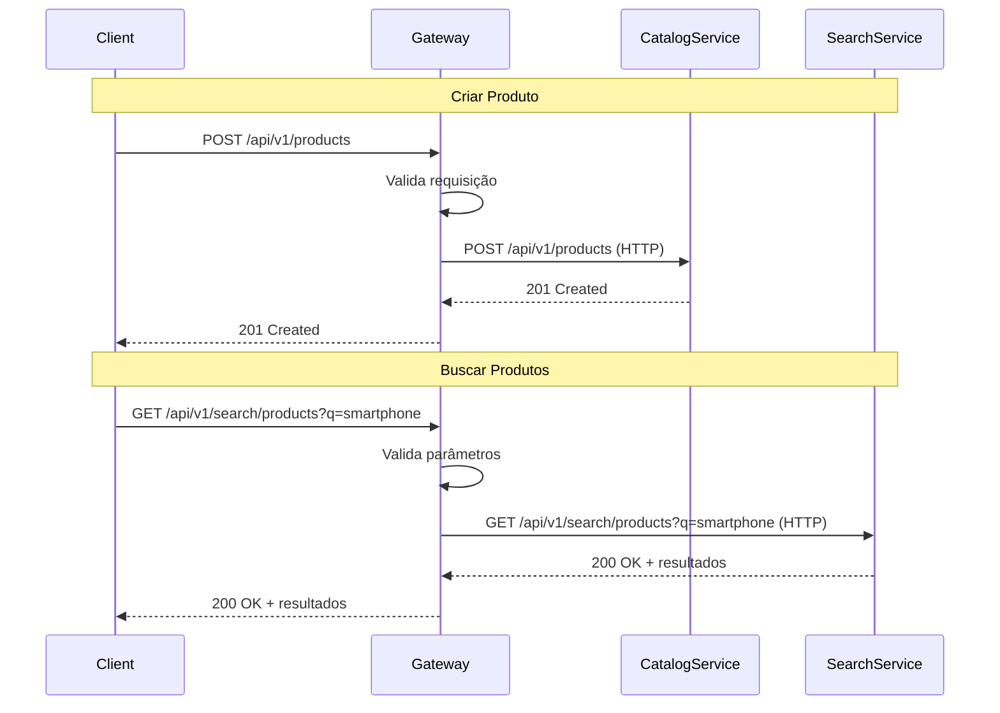

# API Gateway

Gateway de API centralizado que roteia requisições para os microserviços do Marketplace Search System.

## 📋 Descrição Funcional

O API Gateway é o ponto de entrada único para todas as requisições do sistema. Ele é responsável por:

- **Roteamento de Requisições**: Encaminha requisições para os microserviços apropriados
- **Agregação de Respostas**: Combina respostas de múltiplos serviços quando necessário
- **Documentação OpenAPI**: Expõe documentação Swagger/OpenAPI para todos os endpoints
- **Health Checks**: Verifica saúde dos serviços downstream
- **Tratamento de Erros**: Centraliza tratamento de erros e retorna respostas consistentes
- **Validação**: Valida requisições antes de encaminhar aos serviços

## 🏗️ Arquitetura

O API Gateway segue uma **Arquitetura Hexagonal simplificada** com duas camadas principais:

```
api-gateway/
├── interfaces/          # Camada de Interfaces (Ports)
│   └── src/main/java/com/marketplace/search/gateway/interfaces/
│       ├── rest/
│       │   ├── controllers/     # REST Controllers
│       │   ├── clients/         # HTTP Clients (Adapters)
│       │   ├── config/          # Configurações (WebClient, OpenAPI)
│       │   └── dtos/            # Data Transfer Objects
│       └── ...
└── bootstrap/          # Camada de Bootstrap
    └── src/main/java/com/marketplace/search/gateway/bootstrap/
        └── GatewayApp.java      # Classe principal
```

### Camadas

#### Interfaces (Ports)
- **Controllers**: Endpoints REST que recebem requisições
- **Clients**: Portas (interfaces) para comunicação com serviços downstream
- **DTOs**: Objetos de transferência de dados
- **Config**: Configurações de WebClient, OpenAPI, etc.

#### Bootstrap
- **GatewayApp**: Classe principal que inicializa a aplicação Spring Boot
- **Configurações**: Application properties e profiles

## 🔌 Portas (Interfaces)

### CatalogServicePort
Interface para comunicação com o Catalog Service:

```java
public interface CatalogServicePort {
    URI createProduct(Object productObject);
}
```

**Implementação**: `CatalogServiceAdapter` usa `WebClient` para fazer chamadas HTTP.

### SearchServicePort
Interface para comunicação com o Search Service:

```java
public interface SearchServicePort {
    Object searchProducts(String query, String categoryId, Integer page, Integer size, String sort, String userId);
    List<String> getSuggestions(String term, Integer limit);
    ProductDTO getProduct(String productId);
}
```

**Implementação**: `SearchServiceAdapter` usa `WebClient` para fazer chamadas HTTP.

## 📡 Endpoints Expostos

### Health Check
```http
GET /api/v1/health
```

Retorna status do API Gateway.

**Resposta:**
```json
{
  "status": "UP",
  "service": "api-gateway",
  "timestamp": "2024-01-01T12:00:00Z"
}
```

### Criar Produto
```http
POST /api/v1/products
Content-Type: application/json
```

Roteia para `Catalog Service` (porta 8081).

**Request Body:**
```json
{
  "id": "MLB123456",
  "title": "Smartphone Samsung",
  "description": "Descrição do produto",
  "price": 999.99,
  "currency": "BRL",
  "availableQuantity": 10,
  "condition": "NEW",
  "status": "ACTIVE",
  "category": {
    "id": "eletronicos",
    "name": "Eletrônicos"
  },
  "brand": {
    "id": "samsung",
    "name": "Samsung"
  },
  "seller": {
    "id": "seller_001",
    "name": "TechStore"
  }
}
```

**Resposta:**
- `201 Created` - Produto criado com sucesso
- `400 Bad Request` - Dados inválidos
- `502 Bad Gateway` - Erro ao comunicar com Catalog Service

### Buscar Produtos
```http
GET /api/v1/search/products?query=smartphone&categoryId=eletronicos&page=0&size=20&sortBy=relevance
```

Roteia para `Search Service` (porta 8083).

**Query Parameters:**
- `query` (obrigatório): Termo de busca
- `categoryId` (opcional): ID da categoria
- `brand` (opcional): Marca do produto
- `minPrice` (opcional): Preço mínimo
- `maxPrice` (opcional): Preço máximo
- `condition` (opcional): Condição do produto (NEW, USED, etc.)
- `sellerId` (opcional): ID do vendedor
- `page` (padrão: 0): Número da página
- `size` (padrão: 20, máx: 100): Tamanho da página
- `sortBy` (padrão: relevance): Campo de ordenação
- `sortDirection` (padrão: desc): Direção da ordenação
- `userId` (opcional): ID do usuário para personalização

**Resposta:**
```json
{
  "products": [...],
  "totalCount": 156,
  "pageSize": 20,
  "pageNumber": 0,
  "totalPages": 8,
  "hasNextPage": true,
  "hasPreviousPage": false,
  "executionTimeMs": 45,
  "metrics": {
    "queriesPerSecond": 100,
    "usedCache": false
  }
}
```

### Obter Sugestões
```http
GET /api/v1/search/suggestions?term=smart&limit=10
```

Roteia para `Search Service` (porta 8083).

**Query Parameters:**
- `term` (obrigatório): Termo parcial para sugestões
- `limit` (padrão: 10, máx: 20): Limite de sugestões

**Resposta:**
```json
[
  "smartphone samsung",
  "smartphone xiaomi",
  "smartphone apple"
]
```

## ⚙️ Configuração

### Application Properties

```yaml
server:
  port: 8080
  servlet:
    context-path: /api/v1

spring:
  application:
    name: api-gateway

# Serviços Downstream
services:
  catalog:
    url: http://localhost:8081
    timeout: 5000ms
  search:
    url: http://localhost:8083
    timeout: 10000ms
```

### WebClient Configuration

O API Gateway usa `WebClient` (Spring WebFlux) para comunicação reativa com os serviços downstream:

```java
@Configuration
public class WebClientConfig {
    @Bean
    public WebClient catalogServiceClient() {
        return WebClient.builder()
            .baseUrl("http://localhost:8081")
            .defaultHeader(HttpHeaders.CONTENT_TYPE, MediaType.APPLICATION_JSON_VALUE)
            .build();
    }
    
    @Bean
    public WebClient searchServiceClient() {
        return WebClient.builder()
            .baseUrl("http://localhost:8083")
            .defaultHeader(HttpHeaders.CONTENT_TYPE, MediaType.APPLICATION_JSON_VALUE)
            .build();
    }
}
```

### OpenAPI/Swagger

Documentação OpenAPI disponível em:
- **Swagger UI**: http://localhost:8080/api/v1/swagger-ui.html
- **API Docs**: http://localhost:8080/api/v1/api-docs

## 🔄 Fluxo de Requisição



## 🚀 Executar

### Desenvolvimento

```bash
# Compilar
mvn clean compile -pl api-gateway

# Executar
mvn spring-boot:run -pl api-gateway/bootstrap

# Ou executar JAR
mvn clean package -pl api-gateway
java -jar api-gateway/bootstrap/target/bootstrap-*.jar
```

### Verificar Health

```bash
curl http://localhost:8080/api/v1/health
```

## 📊 Monitoramento

### Actuator Endpoints

- **Health**: http://localhost:8080/api/v1/actuator/health
- **Metrics**: http://localhost:8080/api/v1/actuator/metrics
- **Prometheus**: http://localhost:8080/api/v1/actuator/prometheus

### Métricas Importantes

- **Request Rate**: Requisições por segundo
- **Error Rate**: Taxa de erros
- **Latency**: Latência das requisições (P50, P95, P99)
- **Downstream Service Health**: Status dos serviços downstream

## 🔒 Tratamento de Erros

O API Gateway trata erros de forma centralizada:

- **400 Bad Request**: Dados inválidos na requisição
- **502 Bad Gateway**: Erro ao comunicar com serviço downstream
- **503 Service Unavailable**: Serviço downstream indisponível
- **500 Internal Server Error**: Erro interno do gateway

## 🎯 Próximos Passos

- [ ] Implementar Circuit Breaker (Resilience4j)
- [ ] Implementar Rate Limiting
- [ ] Adicionar Autenticação/Autorização
- [ ] Implementar Request/Response Logging
- [ ] Adicionar Distributed Tracing (Jaeger/Zipkin)
- [ ] Implementar Retry com Backoff Exponencial

