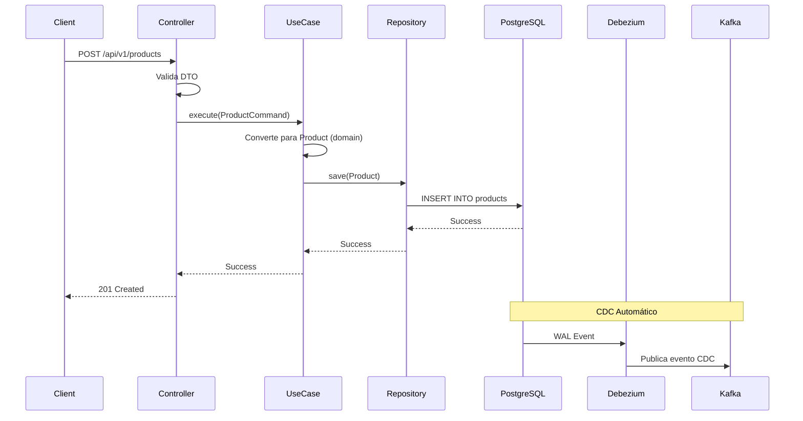

# Catalog Service

Serviço responsável pelo gerenciamento do catálogo de produtos, incluindo CRUD de produtos, categorias, marcas e vendedores.

## 📋 Descrição Funcional

O Catalog Service é responsável por:

- **CRUD de Produtos**: Criar, ler, atualizar e deletar produtos
- **Gerenciamento de Categorias**: Hierarquia de categorias com paths
- **Gerenciamento de Marcas**: Catálogo de marcas
- **Gerenciamento de Vendedores**: Informações de vendedores com reputação
- **Validações de Negócio**: Regras de negócio para produtos
- **Integração CDC**: Publica eventos automaticamente via Debezium/Kafka

## 🏗️ Arquitetura

O Catalog Service segue **Arquitetura Hexagonal** completa com 5 camadas:

```
catalog-service/
├── domain/              # Camada de Domínio (Core)
│   ├── entities/       # Entidades: Product, Category, Brand, Seller
│   ├── valueobjects/    # Value Objects: ProductId, ProductInfo, ProductStatus, etc.
│   └── repositories/    # Ports (interfaces): ProductRepository
├── application/         # Camada de Aplicação
│   ├── usecases/       # Casos de Uso: CreateProductUseCase
│   ├── commands/       # Commands: ProductCommand
│   └── mappers/        # Mappers: ProductMapper
├── infrastructure/     # Camada de Infraestrutura (Adapters)
│   └── persistence/    # Implementações: ProductRepositoryAdapter, ProductEntity
├── interfaces/          # Camada de Interfaces
│   └── rest/           # REST Controllers, DTOs
└── bootstrap/          # Camada de Bootstrap
    └── CatalogApp.java # Classe principal
```

### Fluxo de Dependências

```
interfaces → application → domain
     ↑           ↑
     └───────────┘
infrastructure → domain
```

**Regra**: Dependências apontam para dentro (domain é o núcleo).

## 📦 Modelo de Dados

### Entidades de Domínio

#### Product
Entidade principal que representa um produto no catálogo.

**Componentes:**
- `ProductId`: Identificador único
- `ProductInfo`: Informações básicas (título, descrição, preço, categoria, marca)
- `Seller`: Vendedor do produto
- `ProductMetrics`: Métricas de performance (vendas, avaliações, etc.)
- `ProductStatus`: Status do produto (ACTIVE, INACTIVE, SUSPENDED)

#### Category
Representa uma categoria hierárquica de produtos.

**Características:**
- Path hierárquico: `"eletronicos/celulares/smartphones"`
- Suporte a subcategorias
- Validação de profundidade

#### Brand
Representa uma marca de produtos.

#### Seller
Representa um vendedor com informações de reputação.

**Métricas de Reputação:**
- Score (0-5)
- Total de reviews
- Taxa de cancelamento
- Performance de entrega

### Modelo Relacional (PostgreSQL)

#### Tabelas Principais

**products**
- `id` (PK): Identificador único
- `title`: Título do produto
- `description`: Descrição
- `price`: Preço
- `currency`: Moeda
- `available_quantity`: Quantidade disponível
- `condition`: Condição (NEW, USED, etc.)
- `active`: Status ativo/inativo
- `category_id` (FK): Referência à categoria
- `brand_id` (FK): Referência à marca
- `seller_id` (FK): Referência ao vendedor
- `attributes` (JSONB): Atributos flexíveis
- `created_at`, `updated_at`: Timestamps

**categories**
- `id` (PK): Identificador
- `name`: Nome da categoria
- `path`: Caminho hierárquico
- `parent_id`: Categoria pai (opcional)

**brands**
- `id` (PK): Identificador
- `name`: Nome da marca
- `description`: Descrição

**sellers**
- `id` (PK): Identificador
- `name`: Nome do vendedor
- `type`: Tipo (INDIVIDUAL, COMPANY)
- `status`: Status
- `score`: Score de reputação
- `total_reviews`: Total de reviews
- Métricas de reputação

**product_metrics**
- `product_id` (PK, FK): Referência ao produto
- `total_sales`: Total de vendas
- `total_reviews`: Total de reviews
- `ctr`: Click-through rate
- `average_rating`: Avaliação média
- `popularity`: Score de popularidade

### Índices

- `idx_products_category`: Busca por categoria
- `idx_products_brand`: Busca por marca
- `idx_products_seller`: Busca por vendedor
- `idx_products_price`: Ordenação por preço
- `idx_products_updated_at`: Ordenação por data

## 🔄 Integração com CDC

O Catalog Service integra com **Debezium CDC** para publicar eventos automaticamente:

### Configuração Debezium

A tabela `products` está configurada com `REPLICA IDENTITY FULL`:

```sql
ALTER TABLE products REPLICA IDENTITY FULL;
```

Isso permite que o Debezium capture:
- **INSERT**: Criação de produto
- **UPDATE**: Atualização de produto
- **DELETE**: Deleção de produto

### Fluxo CDC

```
1. Aplicação salva produto no PostgreSQL
2. Debezium captura mudança via WAL
3. Debezium publica evento no Kafka (tópico: catalog-db.public.products)
4. Indexing Service consome evento e indexa no OpenSearch
```

**Vantagens:**
- ✅ Sincronização automática
- ✅ Sem código adicional necessário
- ✅ Baixa latência (< 1s)
- ✅ Transacional (garantido pelo PostgreSQL)

## 📡 API REST

### Criar Produto

```http
POST /api/v1/products
Content-Type: application/json
```

**Request Body:**
```json
{
  "id": "MLB123456",
  "title": "Smartphone Samsung Galaxy",
  "description": "Smartphone com 128GB de armazenamento",
  "price": 999.99,
  "currency": "BRL",
  "availableQuantity": 10,
  "condition": "NEW",
  "status": "ACTIVE",
  "category": {
    "id": "eletronicos",
    "name": "Eletrônicos"
  },
  "brand": {
    "id": "samsung",
    "name": "Samsung"
  },
  "seller": {
    "id": "seller_001",
    "name": "TechStore",
    "reputation": {
      "score": 4.8,
      "totalReviews": 1523
    }
  },
  "images": ["url1", "url2"],
  "attributes": {
    "color": "black",
    "storage": "128GB"
  }
}
```

**Resposta:**
- `201 Created` - Produto criado com sucesso
- `400 Bad Request` - Dados inválidos
- `409 Conflict` - Produto já existe

### Health Check

```http
GET /api/v1/actuator/health
```

## 🎯 Casos de Uso

### CreateProductUseCase

Orquestra o fluxo de criação de um produto:

1. Valida dados do produto
2. Converte DTO para entidade de domínio
3. Persiste no PostgreSQL via `ProductRepository`
4. Debezium captura automaticamente e publica no Kafka

**Implementação:**
```java
@Service
public class CreateProductUseCase {
    private final ProductRepository productRepository;
    private final ProductMapper productMapper;
    
    @Transactional
    public void execute(ProductCommand command) {
        Product product = productMapper.toDomain(command);
        productRepository.save(product);
    }
}
```

## 🔒 Regras de Negócio

### Validações de Produto

- **ID**: Deve ser único e não nulo
- **Título**: Mínimo 3 caracteres, máximo 500
- **Preço**: Deve ser positivo
- **Quantidade**: Deve ser >= 0
- **Categoria**: Deve existir no catálogo
- **Marca**: Deve existir no catálogo
- **Vendedor**: Deve existir no catálogo

### Status de Produto

- **ACTIVE**: Produto ativo e disponível para busca
- **INACTIVE**: Produto inativo (não aparece em buscas)
- **SUSPENDED**: Produto suspenso (com motivo)
- **OUT_OF_STOCK**: Produto sem estoque (ainda aparece em buscas)

### Disponibilidade para Busca

Um produto está disponível para busca se:
- Status é ACTIVE
- Não está suspenso
- Tem estoque disponível (opcional, dependendo da regra)

## 🚀 Executar

### Desenvolvimento

```bash
# Compilar
mvn clean compile -pl catalog-service

# Executar
mvn spring-boot:run -pl catalog-service/bootstrap

# Ou executar JAR
mvn clean package -pl catalog-service
java -jar catalog-service/bootstrap/target/bootstrap-*.jar
```

### Configuração

```yaml
spring:
  application:
    name: catalog
  datasource:
    url: jdbc:postgresql://localhost:5432/marketplace
    username: catalog
    password: catalog123
  jpa:
    hibernate:
      ddl-auto: validate
    show-sql: false

server:
  port: 8081
  servlet:
    context-path: /api/v1
```

## 📊 Monitoramento

### Actuator Endpoints

- **Health**: http://localhost:8081/api/v1/actuator/health
- **Metrics**: http://localhost:8081/api/v1/actuator/metrics
- **Prometheus**: http://localhost:8081/api/v1/actuator/prometheus

### Métricas Importantes

- **Request Rate**: Requisições por segundo
- **Error Rate**: Taxa de erros
- **Database Connection Pool**: Uso do pool de conexões
- **Transaction Rate**: Taxa de transações

## 🔄 Fluxo Completo



## 🎯 Próximos Passos

- [ ] Implementar UpdateProductUseCase
- [ ] Implementar DeleteProductUseCase
- [ ] Implementar GetProductUseCase
- [ ] Adicionar validações de negócio mais complexas
- [ ] Implementar cache para categorias/marcas
- [ ] Adicionar testes de integração
- [ ] Implementar versionamento de API

