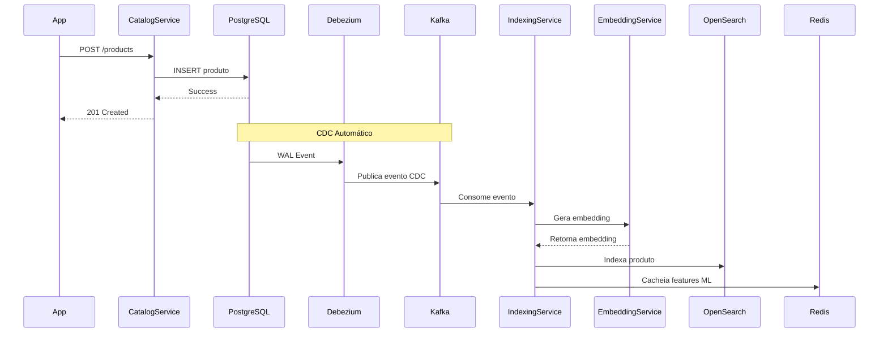
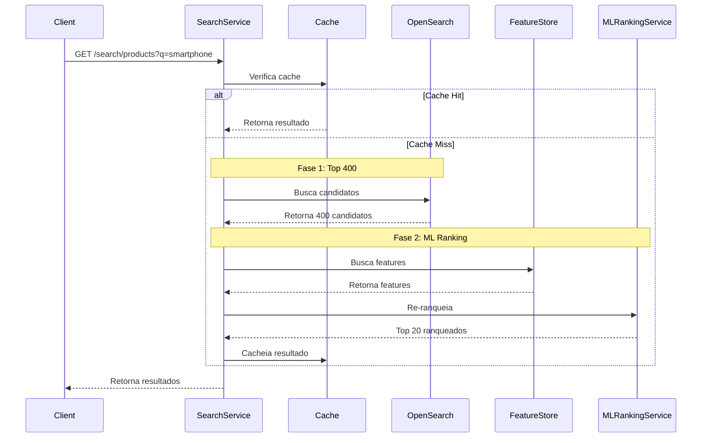

# Arquitetura do Sistema

Documentação completa da arquitetura do Marketplace Search System.

## Visão Geral

O Marketplace Search System é uma aplicação de microserviços que implementa um sistema de busca inteligente para marketplace, utilizando Machine Learning para ranking e Change Data Capture (CDC) para sincronização em tempo real.

## Arquitetura de Microserviços

```
┌─────────────────────────────────────────────────────────────┐
│                      API Gateway (8080)                      │
│              Roteamento e Agregação de Requisições           │
└──────────────┬──────────────────────────────┬────────────────┘
               │                              │
    ┌──────────▼──────────┐      ┌────────────▼──────────┐
    │  Catalog Service    │      │   Search Service      │
    │      (8081)         │      │      (8083)           │
    │  CRUD de Produtos   │      │  Busca com ML Ranking │
    └──────────┬──────────┘      └────────────┬──────────┘
               │                              │
               │                              │
    ┌──────────▼──────────┐      ┌────────────▼──────────┐
    │ Indexing Service    │      │  ML Ranking Service   │
    │      (8082)         │      │      (8084)          │
    │  Indexação CDC      │      │  Re-ranking ML       │
    └──────────┬──────────┘      └──────────────────────┘
               │
    ┌──────────▼──────────┐
    │ ML Embedding Service │
    │      (8085)          │
    │  Geração de Vetores  │
    └──────────────────────┘
```

## Componentes

### API Gateway (Porta 8080)

**Responsabilidades:**
- Roteamento de requisições para microserviços
- Agregação de respostas
- Documentação OpenAPI/Swagger
- Health checks dos serviços downstream

**Tecnologias:**
- Spring Boot 3.2.0
- Spring WebFlux (WebClient)
- OpenAPI 3

### Catalog Service (Porta 8081)

**Responsabilidades:**
- CRUD de produtos
- Gerenciamento de categorias, marcas e vendedores
- Validações de negócio
- Publicação automática de eventos CDC via Debezium

**Tecnologias:**
- Spring Boot 3.2.0
- PostgreSQL 15
- Arquitetura Hexagonal

### Indexing Service (Porta 8082)

**Responsabilidades:**
- Consumo de eventos CDC do Kafka
- Indexação assíncrona no OpenSearch
- Geração de embeddings via ML Embedding Service
- Cálculo e cache de features ML no Redis

**Tecnologias:**
- Spring Boot 3.2.0
- Apache Kafka 3.6.1
- OpenSearch 3.x
- Redis 7
- Processamento assíncrono com ThreadPool

### Search Service (Porta 8083)

**Responsabilidades:**
- Busca de produtos em 2 fases
- Cache inteligente com Redis
- Integração com ML Ranking Service
- Extração de features para ML

**Tecnologias:**
- Spring Boot 3.2.0
- OpenSearch 3.x
- Redis 7
- ML Ranking Service

### ML Ranking Service (Porta 8084)

**Responsabilidades:**
- Re-ranking de produtos usando Machine Learning
- Processamento de 17 features
- Retorno dos Top 20 ranqueados

**Tecnologias:**
- Python 3.11
- FastAPI
- Modelo baseado em pesos fixos (futuro: modelo treinado)

### ML Embedding Service (Porta 8085)

**Responsabilidades:**
- Geração de embeddings vetoriais
- Modelo: sentence-transformers/all-MiniLM-L6-v2
- Dimensão: 384

**Tecnologias:**
- Python 3.11
- FastAPI
- sentence-transformers
- PyTorch

## Arquitetura Hexagonal

Todos os serviços Java seguem **Arquitetura Hexagonal (Port/Adapter)**:

```
┌─────────────────────────────────────────────────────────────┐
│                         INTERFACES                          │
│                    (REST Controllers)                       │
└────────────────────────────┬────────────────────────────────┘
                             │
                             ▼
┌─────────────────────────────────────────────────────────────┐
│                        APPLICATION                          │
│                        (Use Cases)                          │
│                                                             │
│  CreateProductUseCase                                       │
│  ├─ ProductMapper (converte DTO → Domain)                  │
│  └─ ProductRepository (PORT/INTERFACE) ✅                   │
└────────────────────────────┬────────────────────────────────┘
                             │
                             │ depende apenas de
                             ▼
┌─────────────────────────────────────────────────────────────┐
│                          DOMAIN                             │
│                 (Entities, Value Objects)                   │
│                                                             │
│  Product (entidade)                                         │
│  ProductRepository (INTERFACE/PORT) ✅                      │
│  EventPublisher (INTERFACE/PORT)                            │
└─────────────────────────────────────────────────────────────┘
                             ▲
                             │ implementa
                             │
┌─────────────────────────────────────────────────────────────┐
│                      INFRASTRUCTURE                         │
│                         (Adapters)                          │
│                                                             │
│  ProductRepositoryAdapter implements ProductRepository ✅   │
│  ├─ ProductEntity (JPA)                                     │
│  ├─ ProductEntityMapper                                   │
│  └─ ProductJpaRepository (Spring Data)                     │
│                                                             │
│  KafkaEventPublisher implements EventPublisher              │
│  OpenSearchProductRepository                                │
└─────────────────────────────────────────────────────────────┘
```

### Regras de Dependência

**✅ PERMITIDO:**
1. **interfaces** → **application** → **domain**
2. **infrastructure** → **domain** (implementa ports)
3. **bootstrap** → todas as camadas (wiring/DI)

**❌ PROIBIDO:**
1. **application** → **infrastructure** ❌
2. **domain** → qualquer camada ❌
3. **application** → **interfaces** ❌

### Benefícios

1. **Testabilidade**: Use cases podem ser testados com mocks
2. **Flexibilidade**: Trocar tecnologias sem mudar use cases
3. **Independência**: Domain e Application não conhecem infraestrutura
4. **SOLID**: Princípio de Inversão de Dependências (DIP)
5. **Clean Architecture**: Dependências apontam para dentro (domain)

## Fluxo de Dados

### Fluxo de Indexação (CDC)



### Fluxo de Busca (2 Fases)



## Infraestrutura

### Banco de Dados

**PostgreSQL 15**
- Banco transacional principal
- Tabelas: products, categories, brands, sellers, product_metrics
- WAL habilitado para CDC (wal_level=logical)

### Cache e Feature Store

**Redis 7**
- Cache de resultados de busca (TTL: 1 hora)
- Feature Store para features ML (TTL: 1 hora)
- Chaves prefixadas por tipo

### Motor de Busca

**OpenSearch 3.x**
- Índice de produtos para busca
- Suporte a BM25 e k-NN (busca semântica)
- Queries híbridas (BM25 + k-NN)

### Mensageria

**Apache Kafka 3.6.1**
- Distribuição de eventos CDC
- Tópico: `catalog-db.public.products`
- Consumer groups por serviço

**Debezium 2.6.0**
- Change Data Capture (CDC)
- Captura mudanças via WAL do PostgreSQL
- Publica eventos no Kafka

### Monitoramento

**Prometheus**
- Coleta de métricas
- Endpoint: `/actuator/prometheus`

**Grafana**
- Visualização de métricas
- Dashboards customizados

## Padrões Arquiteturais

### Port/Adapter (Hexagonal Architecture)

Interfaces (ports) definidas no domain, implementações (adapters) na infrastructure.

### Event-Driven Architecture

Sincronização via eventos CDC, processamento assíncrono.

### CQRS (Command Query Responsibility Segregation)

- **Commands**: Catalog Service (escrita)
- **Queries**: Search Service (leitura)

### 2-Phase Search

- **Fase 1**: Busca rápida de candidatos (Top 400)
- **Fase 2**: Re-ranking ML para Top 20

## Escalabilidade

### Horizontal Scaling

- Cada serviço pode escalar independentemente
- Stateless services (exceto cache)
- Load balancer no API Gateway

### Performance

- **Cache Hit Rate**: > 80%
- **Search Latency**: < 200ms (P95)
- **Indexation Throughput**: > 10k produtos/min
- **Consumer Lag**: ~0

## Segurança

### Autenticação/Autorização

- **TODO**: Implementar OAuth2/JWT
- **TODO**: Rate limiting no API Gateway

### Dados Sensíveis

- Variáveis de ambiente para credenciais
- Secrets management (futuro: Vault)

## Observabilidade

### Logging

- Logs estruturados (JSON)
- Níveis configuráveis por ambiente
- Centralização (futuro: ELK Stack)

### Métricas

- Micrometer + Prometheus
- Métricas customizadas por serviço
- Dashboards no Grafana

### Tracing

- **TODO**: Distributed tracing (Jaeger/Zipkin)

## Referências

- [Arquitetura Hexagonal](https://alistair.cockburn.us/hexagonal-architecture/)
- [Clean Architecture](https://blog.cleancoder.com/uncle-bob/2012/08/13/the-clean-architecture.html)
- [Event-Driven Architecture](https://martinfowler.com/articles/201701-event-driven.html)
