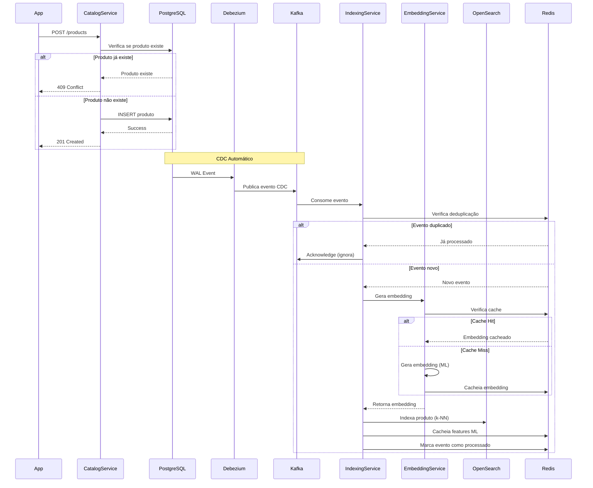
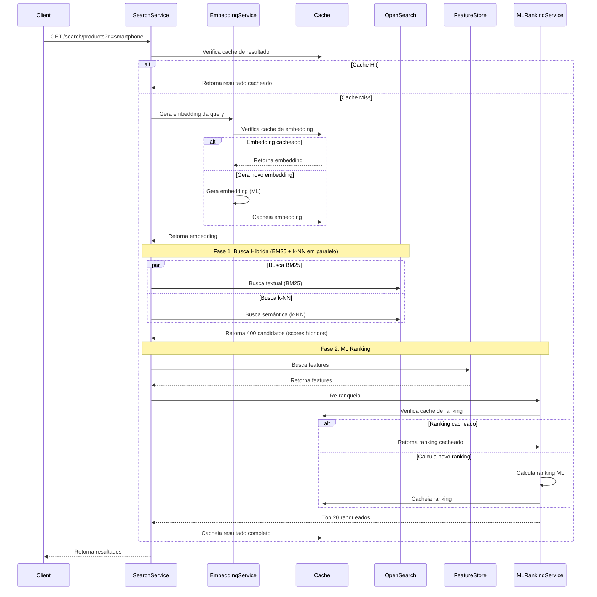

# Arquitetura do Sistema

Documentação completa da arquitetura do Marketplace Search System.

## Visão Geral

O Marketplace Search System é uma aplicação de microserviços que implementa um sistema de busca inteligente para marketplace, utilizando Machine Learning para ranking e Change Data Capture (CDC) para sincronização em tempo real.

## Arquitetura de Microserviços

```
┌─────────────────────────────────────────────────────────────┐
│                      API Gateway (8080)                      │
│              Roteamento e Agregação de Requisições           │
└──────────────┬──────────────────────────────┬────────────────┘
               │                              │
    ┌──────────▼──────────┐      ┌────────────▼──────────┐
    │  Catalog Service    │      │   Search Service      │
    │      (8081)         │      │      (8083)           │
    │  CRUD de Produtos   │      │  Busca com ML Ranking │
    └──────────┬──────────┘      └────────────┬──────────┘
               │                              │
               │                              │
    ┌──────────▼──────────┐      ┌────────────▼──────────┐
    │ Indexing Service    │      │  ML Ranking Service   │
    │      (8082)         │      │      (8084)          │
    │  Indexação CDC      │      │  Re-ranking ML       │
    └──────────┬──────────┘      └──────────────────────┘
               │
    ┌──────────▼──────────┐
    │ ML Embedding Service │
    │      (8085)          │
    │  Geração de Vetores  │
    └──────────────────────┘
```

## Componentes

### API Gateway (Porta 8080)

**Responsabilidades:**
- Roteamento de requisições para microserviços
- Agregação de respostas
- Documentação OpenAPI/Swagger
- Health checks dos serviços downstream

**Tecnologias:**
- Spring Boot 3.2.0
- Spring WebFlux (WebClient)
- OpenAPI 3

### Catalog Service (Porta 8081)

**Responsabilidades:**
- CRUD de produtos
- **Idempotência**: Verifica se produto já existe antes de criar (evita duplicação)
- Gerenciamento de categorias, marcas e vendedores
- Validações de negócio
- Publicação automática de eventos CDC via Debezium

**Tecnologias:**
- Spring Boot 3.2.0
- PostgreSQL 15
- Arquitetura Hexagonal

**Idempotência:**
- Verifica `existsById()` antes de criar produto
- Lança `ProductAlreadyExistsException` se produto já existe
- Evita duplicação no banco e consequente duplicação no Kafka

**Resiliência no Debezium:**
- O registro ou atualização do conector Debezium roda de forma assíncrona (`ApplicationReadyEvent` com `CompletableFuture.runAsync()`).
- Implementa mecanismo de retentativa (máximo de 30 tentativas espaçadas em 10 segundos) para que o serviço não dependa da inicialização imediata e síncrona do Kafka Connect, garantindo resiliência e evitando falhas de bootstrap.

### Indexing Service (Porta 8082)

**Responsabilidades:**
- Consumo de eventos CDC do Kafka
- **Deduplicação de Eventos**: Previne reprocessamento de eventos duplicados via Redis
- Indexação assíncrona no OpenSearch
- **Inicialização de Índices**: Cria automaticamente índices k-NN no OpenSearch
- Geração de embeddings via ML Embedding Service
- Cálculo e cache de features ML no Redis

**Tecnologias:**
- Spring Boot 3.2.0
- Apache Kafka 3.6.1
- OpenSearch 3.x
- Redis 7
- Processamento assíncrono com ThreadPool

**Deduplicação de Eventos:**
- Usa Redis para rastrear eventos processados
- Chave única: `event:processed:{productId}:{timestamp}:{offset}`
- TTL configurável (padrão: 7 dias = 168 horas)
- Operação atômica usando SETNX
- Evita reprocessamento em caso de retry ou rebalanceamento do Kafka

**Backpressure e Controle de Fluxo:**
- **ThreadPool com CallerRunsPolicy**: O `ThreadPoolTaskExecutor` (executor assíncrono para indexação) está configurado com `CallerRunsPolicy`. Quando a fila de tarefas de indexação enche (limite de 1000 pendentes), a própria thread produtora (o Kafka Listener) executa o processamento. Isso reduz automaticamente o ritmo de consumo do Kafka.
- **Join Blocking no Listener**: A thread de leitura do Kafka bloqueia explicitamente usando `processingFuture.join()`. Isso impede que o Kafka dispare novos `poll()` enquanto a indexação e o enriquecimento de dados no OpenSearch e Embedding Service estiverem sob alta carga.
- **Ajuste de Mensagens por Poll**: A propriedade `max-poll-records` foi reduzida de 500 para 50, permitindo um tráfego mais suave e melhor gerenciamento de memória.
- **Manual Ack**: A confirmação de entrega do offset do Kafka (`ManualImmediate`) só é realizada se o processamento e sincronização terminarem com sucesso, prevenindo perda de mensagens (at-least-once semantic).

### Search Service (Porta 8083)

**Responsabilidades:**
- **Busca Híbrida**: Combinação de BM25 (textual) + k-NN (semântica) em paralelo
- Busca de produtos em 2 fases
- Geração de embeddings de queries via ML Embedding Service
- Cache inteligente com Redis
- Integração com ML Ranking Service
- Extração de features para ML

**Tecnologias:**
- Spring Boot 3.2.0
- OpenSearch 3.x
- Redis 7
- Caffeine (L1 Cache)
- ML Ranking Service
- ML Embedding Service

**ML Ranking URL Configuration:**
- Utiliza a variável de ambiente `ML_RANKING_SERVICE_URL`.
- Fallback em ambiente Docker para `http://ml-ranking-service:8084`.
- Resolve o erro de `Connection refused` que ocorria ao tentar acessar `localhost`.

**Busca Híbrida:**
- Fase 1: Executa BM25 e k-NN em paralelo no OpenSearch
- Embedding da query gerado pelo ML Embedding Service
- Combina scores BM25 e k-NN para relevância híbrida
- Retorna Top 400 candidatos
- Fallback para apenas BM25 se Embedding Service indisponível

**Cache Híbrido de L1 e L2 para Features (Caffeine + Redis):**
- O `RedisFeatureStore` gerencia as features de Machine Learning estruturadas de forma híbrida:
  - **L1 (In-Memory)**: Utiliza **Caffeine** local na JVM com limite configurável (padrão 10.000 itens) e expiração por escrita (padrão 300s). Evita requests desnecessários ao Redis.
  - **L2 (Redis Hash)**: A segunda camada lê as features em Redis em formato Hash com TTL de 1 hora.
- **Pipelining em Lote**: Para o re-ranking (Phase 2) com até 400 candidatos, a leitura de L2 e a escrita em lote são realizadas utilizando **Redis Pipelining** (`getFeaturesBatch` / `saveFeaturesBatch`), minimizando o Round Trip Time (RTT).

### ML Ranking Service (Porta 8084)

**Responsabilidades:**
- Re-ranking de produtos usando Machine Learning
- Processamento de 17 features
- Retorno dos Top 20 ranqueados
- **Cache Redis**: Cacheia features e resultados de ranking

**Tecnologias:**
- Python 3.11
- FastAPI
- Redis 7 (cache)
- Modelo baseado em pesos fixos (futuro: modelo treinado)

**Cache:**
- Utiliza a biblioteca `python-dotenv` para carregamento de configurações.
- **Boot Ativo**: Abre conexão com Redis no construtor (`connect()`) em vez de apenas checar estado.
- Cacheia embeddings e features calculadas.
- Health check verifica conectividade real com Redis.

### ML Embedding Service (Porta 8085)

**Responsabilidades:**
- Geração de embeddings vetoriais para produtos e queries
- **Cache Redis**: Cacheia embeddings gerados para melhor performance
- Modelo: sentence-transformers/all-MiniLM-L6-v2
- Dimensão: 384
- Normalização L2

**Tecnologias:**
- Python 3.11
- FastAPI
- Redis 7 (cache)
- sentence-transformers
- PyTorch

**Cache:**
- Cacheia embeddings de produtos e queries
- Reduz chamadas ao modelo ML
- Health check verifica conectividade com Redis
- TTL configurável para otimização de memória

## Arquitetura Hexagonal

Todos os serviços Java seguem **Arquitetura Hexagonal (Port/Adapter)**:

```
┌─────────────────────────────────────────────────────────────┐
│                         INTERFACES                          │
│                    (REST Controllers)                       │
└────────────────────────────┬────────────────────────────────┘
                             │
                             ▼
┌─────────────────────────────────────────────────────────────┐
│                        APPLICATION                          │
│                        (Use Cases)                          │
│                                                             │
│  CreateProductUseCase                                       │
│  ├─ ProductMapper (converte DTO → Domain)                  │
│  └─ ProductRepository (PORT/INTERFACE) ✅                   │
└────────────────────────────┬────────────────────────────────┘
                             │
                             │ depende apenas de
                             ▼
┌─────────────────────────────────────────────────────────────┐
│                          DOMAIN                             │
│                 (Entities, Value Objects)                   │
│                                                             │
│  Product (entidade)                                         │
│  ProductRepository (INTERFACE/PORT) ✅                      │
│  EventPublisher (INTERFACE/PORT)                            │
└─────────────────────────────────────────────────────────────┘
                             ▲
                             │ implementa
                             │
┌─────────────────────────────────────────────────────────────┐
│                      INFRASTRUCTURE                         │
│                         (Adapters)                          │
│                                                             │
│  ProductRepositoryAdapter implements ProductRepository ✅   │
│  ├─ ProductEntity (JPA)                                     │
│  ├─ ProductEntityMapper                                   │
│  └─ ProductJpaRepository (Spring Data)                     │
│                                                             │
│  KafkaEventPublisher implements EventPublisher              │
│  OpenSearchProductRepository                                │
└─────────────────────────────────────────────────────────────┘
```

### Regras de Dependência

**✅ PERMITIDO:**
1. **interfaces** → **application** → **domain**
2. **infrastructure** → **domain** (implementa ports)
3. **bootstrap** → todas as camadas (wiring/DI)

**❌ PROIBIDO:**
1. **application** → **infrastructure** ❌
2. **domain** → qualquer camada ❌
3. **application** → **interfaces** ❌

### Benefícios

1. **Testabilidade**: Use cases podem ser testados com mocks
2. **Flexibilidade**: Trocar tecnologias sem mudar use cases
3. **Independência**: Domain e Application não conhecem infraestrutura
4. **SOLID**: Princípio de Inversão de Dependências (DIP)
5. **Clean Architecture**: Dependências apontam para dentro (domain)

## Fluxo de Dados

### Fluxo de Indexação (CDC)



### Fluxo de Busca (2 Fases)



## Infraestrutura

### Banco de Dados

**PostgreSQL 15**
- Banco transacional principal
- Tabelas: products, categories, brands, sellers, product_metrics
- WAL habilitado para CDC (wal_level=logical)

### Cache e Feature Store

**Redis 7 (L2 Cache & Feature Store) & Caffeine (L1 Cache)**
- **L1 Feature Cache (Caffeine)**: Em memória JVM no Search Service para acesso de baixíssima latência (TTL de 5 minutos, limite de 10.000 itens).
- **L2 Feature Store (Redis)**: Cache distribuído persistido por Hash (TTL de 1 hora) com prefixo `feature:ml:{productId}`.
- **Pipelining em Lote**: Leituras e gravações em lote no Redis são pipelinadas para reduzir o RTT.
- Cache de resultados de busca (TTL: 1 hora)
- **Deduplicação de eventos**: Chaves `event:processed:{productId}:{timestamp}:{offset}` (TTL: 7 dias)
- **Cache de embeddings**: Embeddings de produtos e queries (TTL configurável)
- **Cache de rankings**: Resultados de ranking ML (TTL configurável)
- Chaves prefixadas por tipo

### Motor de Busca

**OpenSearch 3.x**
- Índice de produtos para busca
- Suporte a BM25 e k-NN (busca semântica)
- **Queries híbridas**: BM25 + k-NN executadas em paralelo
- **Inicialização automática**: Índices k-NN criados automaticamente
- Vetores de embedding armazenados no índice (dimensão: 384)

### Mensageria

**Apache Kafka 3.6.1**
- Distribuição de eventos CDC
- Tópico: `catalog-db.public.products`
- Consumer groups por serviço

**Debezium 2.6.0**
- Change Data Capture (CDC)
- Captura mudanças via WAL do PostgreSQL
- Publica eventos no Kafka

### Monitoramento

**Prometheus**
- Coleta de métricas
- Endpoint: `/actuator/prometheus`

**Grafana**
- Visualização de métricas
- Dashboards customizados

## Padrões Arquiteturais

### Port/Adapter (Hexagonal Architecture)

Interfaces (ports) definidas no domain, implementações (adapters) na infrastructure.

### Event-Driven Architecture

Sincronização via eventos CDC, processamento assíncrono.

### CQRS (Command Query Responsibility Segregation)

- **Commands**: Catalog Service (escrita)
- **Queries**: Search Service (leitura)

### 2-Phase Search

- **Fase 1**: Busca híbrida rápida de candidatos (Top 400)
  - BM25 (textual) e k-NN (semântica) executadas em paralelo
  - Embedding da query gerado pelo ML Embedding Service
  - Combinação de scores para relevância híbrida
- **Fase 2**: Re-ranking ML para Top 20
  - Extração de 17 features dos candidatos
  - Re-ranking via ML Ranking Service
  - Cache de features e resultados

## Escalabilidade

### Horizontal Scaling

- Cada serviço pode escalar independentemente
- Stateless services (exceto cache)
- Load balancer no API Gateway

### Performance

- **Cache Hit Rate**: > 80%
- **Search Latency**: < 200ms (P95)
- **Indexation Throughput**: > 10k produtos/min
- **Consumer Lag**: ~0

## Segurança

### Autenticação/Autorização

- **TODO**: Implementar OAuth2/JWT
- **TODO**: Rate limiting no API Gateway

### Dados Sensíveis

- Variáveis de ambiente para credenciais
- Secrets management (futuro: Vault)

## Observabilidade

### Logging (Centralizado)

O sistema utiliza uma stack moderna de agregação de logs:
- **Fluent Bit**: Atua como agente coletor (DaemonSet style) que lê os logs do Docker em `/var/lib/docker/containers`.
- **OpenSearch**: Backend de armazenamento e indexação textual massiva.
- **Grafana**: Dashboard "Marketplace - Logs Centralizados" com suporte a queries Lucene.
- **Retenção**: 7 dias garantidos por Index Lifecycle Management (ILM).
- **Correlação**: Logs injetam automaticamente `trace_id` e `span_id` para navegação direta ao Jaeger.
- **PII Sanitizer**: Mascaramento automático de campos sensíveis (password, credit_card) no API Gateway.
- **Logs Estruturados**: Logs formatados em JSON (ECS/Logstash compatível) via Logback (`logback-spring.xml`) sem caracteres ANSI (`spring.output.ansi.enabled: never`), otimizando a leitura do Fluent Bit.

### Métricas

- Micrometer + Prometheus
- Métricas customizadas por serviço
- Dashboards no Grafana

### Tracing Distribuído

- **Jaeger**: Rastreamento completo das requisições entre serviços.
- **OpenTelemetry**: SDKs em Go e Java para instrumentação nativa.
- **Amostragem**: Configurada em 5% no API Gateway para balancear visibilidade e performance.
- **Visualização**: Dashboards que permitem ver o fluxo desde o Traefik até os serviços de ML.

## Referências

- [Arquitetura Hexagonal](https://alistair.cockburn.us/hexagonal-architecture/)
- [Clean Architecture](https://blog.cleancoder.com/uncle-bob/2012/08/13/the-clean-architecture.html)
- [Event-Driven Architecture](https://martinfowler.com/articles/201701-event-driven.html)
