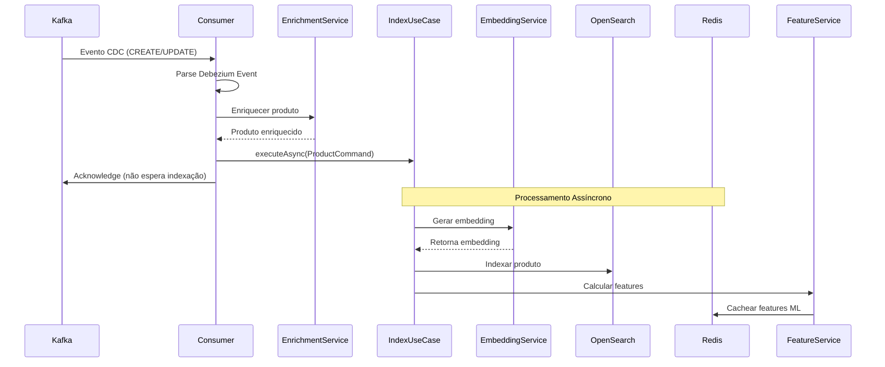

# Indexing Service

Serviço responsável pela indexação assíncrona de produtos no OpenSearch, consumindo eventos CDC do Kafka e integrando com serviços ML.

## 📋 Descrição Funcional

O Indexing Service é responsável por:

- **Consumo de Eventos CDC**: Consome eventos do Kafka gerados pelo Debezium
- **Indexação Assíncrona**: Processa indexação em background usando ThreadPool
- **Enriquecimento de Dados**: Enriquece produtos com dados de dimensões (categoria, marca, vendedor)
- **Geração de Embeddings**: Integra com ML Embedding Service para gerar vetores
- **Cálculo de Features ML**: Calcula e cacheia features ML no Redis
- **Indexação no OpenSearch**: Persiste produtos indexados para busca

## 🏗️ Arquitetura

O Indexing Service segue **Arquitetura Hexagonal** completa:

```
indexing-service/
├── domain/              # Camada de Domínio (Core)
│   ├── entities/       # Entidades: Product
│   └── repositories/    # Ports: ProductIndexRepository
├── application/         # Camada de Aplicação
│   ├── usecases/       # Casos de Uso: IndexProductUseCase
│   ├── commands/       # Commands: ProductCommand
│   ├── handlers/       # Event Handlers: ProductEventHandler
│   ├── services/       # Services: ProductFeatureCalculationService, ProductEnrichmentService
│   └── mappers/        # Mappers: ProductMapper
├── infrastructure/     # Camada de Infraestrutura (Adapters)
│   ├── kafka/         # Kafka Consumers
│   ├── opensearch/    # OpenSearch Repository
│   ├── redis/         # Redis Client
│   ├── ml/            # ML Service Clients
│   └── config/        # Configurações: AsyncConfig, KafkaConfig
└── bootstrap/          # Camada de Bootstrap
    └── IndexingApp.java # Classe principal
```

## 🔄 Fluxo de Indexação

### Fluxo Completo



### Processamento Assíncrono

O Indexing Service processa eventos de forma **assíncrona** para não bloquear o consumer do Kafka:

**Antes (Síncrono):**
- Consumer bloqueado esperando OpenSearch (~200ms)
- Throughput: ~5 msg/s
- Lag do Kafka crescente

**Depois (Assíncrono):**
- Consumer confirma mensagem imediatamente (~10ms)
- Indexação acontece em background via ThreadPool
- Throughput: ~100-500 msg/s

## 📦 Componentes Principais

### ProductEventHandler

Consome eventos CDC do Kafka e dispara indexação assíncrona.

**Operações Suportadas:**
- `c` (create): Criação de produto
- `r` (read): Snapshot inicial
- `u` (update): Atualização de produto
- `d` (delete): Deleção de produto (TODO)

**Fluxo:**
1. Recebe evento do Kafka
2. Parse do evento Debezium
3. Enriquece produto com dados de dimensões
4. Dispara indexação assíncrona
5. Confirma mensagem (acknowledge)

### IndexProductUseCase

Caso de uso para indexação de produtos.

**Método Assíncrono:**
```java
@Async("asyncIndexingExecutor")
public CompletableFuture<Void> executeAsync(ProductCommand productDTO) {
    // 1. Converter para entidade de domínio
    Product product = productMapper.toDomain(productDTO);
    
    // 2. Indexar no OpenSearch
    indexRepository.indexProduct(product);
    
    // 3. Calcular e cachear features ML
    featureCalculationService.calculateAndCacheFeatures(product);
    
    return CompletableFuture.completedFuture(null);
}
```

### ProductEnrichmentService

Enriquece produtos com dados de dimensões (categoria, marca, vendedor).

**Responsabilidades:**
- Buscar nome da categoria
- Buscar nome da marca
- Buscar nome e reputação do vendedor
- Buscar métricas do produto

### ProductFeatureCalculationService

Calcula features ML e cacheia no Redis.

**Features Calculadas:**
- Relevância (BM25, k-NN, híbrido)
- Match textual (exact match, term coverage)
- Qualidade do texto (título, descrição)
- Contexto (primeira palavra, números, marca, categoria)
- Popularidade (score, qualidade, CTR, vendas)

### AsyncConfig

Configuração do ThreadPool para processamento assíncrono.

**Configuração:**
- Core Pool Size: 5 threads
- Max Pool Size: 10 threads
- Queue Capacity: 100 tarefas
- Graceful Shutdown: Aguarda 60s

## 🔌 Integrações

### Kafka Consumer

**Configuração:**
```yaml
kafka:
  bootstrap-servers: localhost:9092
  consumer:
    group-id: indexing-service-consumer
    auto-offset-reset: earliest
    enable-auto-commit: false
    max-poll-records: 500
  topics:
    product-events: catalog-db.public.products
```

**Tópico Consumido:**
- `catalog-db.public.products`: Eventos CDC do Debezium

### OpenSearch

**Configuração:**
```yaml
opensearch:
  host: localhost
  port: 9200
  scheme: http
  index:
    products: products-index
```

**Operações:**
- `indexProduct`: Indexa ou atualiza produto
- `deleteProduct`: Remove produto do índice (TODO)

### Redis (Feature Store)

**Configuração:**
```yaml
ml:
  feature-store:
    ttl-seconds: 3600  # 1 hora
    redis-key-prefix: feature:ml:
```

**Uso:**
- Cache de features ML calculadas
- TTL de 1 hora
- Chave: `feature:ml:{productId}`

### ML Embedding Service

**Configuração:**
```yaml
embedding:
  service:
    url: http://localhost:8085
    timeout-seconds: 30
    max-retries: 3
    enabled: true
```

**Uso:**
- Gera embeddings para título/descrição do produto
- Dimensão: 384
- Modelo: `sentence-transformers/all-MiniLM-L6-v2`

## 📊 Processamento Assíncrono

### ThreadPool Configuration

```java
@Bean(name = "asyncIndexingExecutor")
public Executor getAsyncExecutor() {
    ThreadPoolTaskExecutor executor = new ThreadPoolTaskExecutor();
    executor.setCorePoolSize(5);        // Threads mínimas
    executor.setMaxPoolSize(10);        // Threads máximas
    executor.setQueueCapacity(100);     // Fila de tarefas
    executor.setThreadNamePrefix("async-indexer-");
    return executor;
}
```

### Benefícios

- ✅ **Alto Throughput**: Consumer processa 100-500 msg/s
- ✅ **Não Bloqueia**: Consumer livre após ~10ms
- ✅ **Paralelismo**: Múltiplas indexações simultâneas
- ✅ **Resiliência**: Erros não travam o consumer

### Métricas Esperadas

- **Consumer Throughput**: 100-500 msg/s
- **Indexação Latency**: 200-500ms (background)
- **ThreadPool Usage**: < 80% em carga normal
- **Queue Size**: < 50 tarefas em carga normal

## 🚀 Executar

### Desenvolvimento

```bash
# Compilar
mvn clean compile -pl indexing-service

# Executar
mvn spring-boot:run -pl indexing-service/bootstrap

# Ou executar JAR
mvn clean package -pl indexing-service
java -jar indexing-service/bootstrap/target/bootstrap-*.jar
```

### Configuração

```yaml
spring:
  application:
    name: indexing-service
  kafka:
    bootstrap-servers: localhost:9092
    consumer:
      group-id: indexing-service-consumer
  data:
    redis:
      host: localhost
      port: 6379

opensearch:
  host: localhost
  port: 9200
  index:
    products: products-index

embedding:
  service:
    url: http://localhost:8085
```

## 📊 Monitoramento

### Actuator Endpoints

- **Health**: http://localhost:8082/api/v1/actuator/health
- **Metrics**: http://localhost:8082/api/v1/actuator/metrics
- **Prometheus**: http://localhost:8082/api/v1/actuator/prometheus

### Métricas Importantes

- **Kafka Consumer Lag**: Deve ser ~0
- **Indexation Rate**: Produtos indexados por segundo
- **ThreadPool Active**: Threads ativas
- **ThreadPool Queue**: Tarefas na fila
- **OpenSearch Latency**: Latência de indexação
- **Feature Calculation Rate**: Features calculadas por segundo

### Logs

O serviço gera logs estruturados para:
- Eventos CDC recebidos
- Produtos enriquecidos
- Indexações iniciadas/completadas
- Erros de processamento

## 🔄 Fluxo Detalhado

### 1. Recebimento de Evento CDC

```java
@KafkaListener(topics = "${kafka.topics.product-events}")
public void handleProductEvent(ConsumerRecord<String, String> record, Acknowledgment ack) {
    // Parse evento Debezium
    DebeziumCDCEvent cdcEvent = parseEvent(record);
    
    // Processar baseado na operação
    if (cdcEvent.isCreate() || cdcEvent.isUpdate()) {
        processProductUpsert(cdcEvent);
    } else if (cdcEvent.isDelete()) {
        processProductDeletion(cdcEvent);
    }
    
    // Confirmar mensagem
    ack.acknowledge();
}
```

### 2. Enriquecimento

```java
ProductPayload enriched = enrichmentService.enrich(productData);
// Busca categoria, marca, vendedor, métricas
```

### 3. Indexação Assíncrona

```java
@Async("asyncIndexingExecutor")
public CompletableFuture<Void> executeAsync(ProductCommand command) {
    // 1. Gerar embedding
    Embedding embedding = embeddingService.generate(product.getTitle());
    
    // 2. Indexar no OpenSearch
    indexRepository.indexProduct(product, embedding);
    
    // 3. Calcular features
    Features features = calculateFeatures(product);
    
    // 4. Cachear features
    redis.put("feature:ml:" + productId, features, TTL);
}
```

## ⚠️ Considerações

### Eventual Consistency

- Mensagem confirmada **antes** da indexação
- Produto aparece no OpenSearch com delay de ~200-500ms
- Aceitável para casos de uso de busca

### Tratamento de Erros

- Erros de indexação são **logados**
- Handler customizado captura exceções não tratadas
- **TODO**: Implementar retry automático
- **TODO**: Implementar Dead Letter Queue (DLQ)

### Backpressure

- ThreadPool tem fila de 100 tarefas
- Se fila encher, novas tarefas são rejeitadas
- Solução: Aumentar `queueCapacity` ou threads

## 🎯 Próximos Passos

- [ ] Implementar DeleteProductUseCase
- [ ] Implementar retry automático com backoff exponencial
- [ ] Adicionar Dead Letter Queue (DLQ) para erros persistentes
- [ ] Implementar circuit breaker para OpenSearch
- [ ] Adicionar métricas customizadas (indexação/s)
- [ ] Monitorar tamanho da fila do ThreadPool
- [ ] Alertas quando fila estiver >80% cheia
- [ ] Implementar health check do ThreadPool

