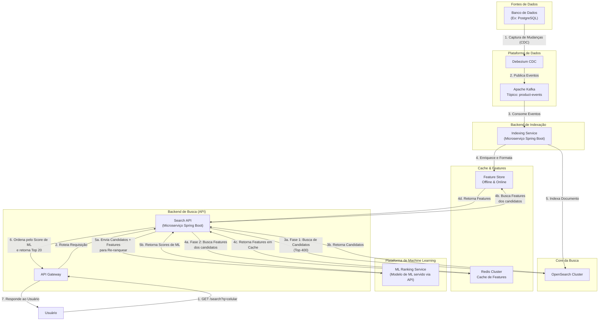

<<<<<<< HEAD
# Marketplace Search System

Sistema de busca para marketplace seguindo arquitetura hexagonal, preparado para microserviços e alta escala.

## 🏗️ Arquitetura

O projeto segue **Arquitetura Hexagonal (Ports & Adapters)** organizada em módulos Maven:

```
search-system/
├── domain/          # 🔵 Domínio - Entities, Value Objects, Repositories
├── application/     # 🟡 Aplicação - Use Cases, DTOs, Mappers
├── infrastructure/  # 🟢 Infraestrutura - OpenSearch, Kafka, Redis
├── interfaces/      # 🟠 Interfaces - REST API, Consumers
└── bootstrap/       # ⚫ Bootstrap - Configuração e inicialização
```

## 🚀 Tecnologias

- **Java 17** + **Spring Boot 3.2.0**
- **OpenSearch 8.11.3** - Motor de busca principal
- **Apache Kafka 3.6.1** - Eventos e CDC em tempo real
- **Redis 7** - Cache de alta performance
- **Maven** - Gerenciamento de dependências
- **Docker Compose** - Ambiente de desenvolvimento

## 📦 Funcionalidades

### ✅ Implementado
- [x] **Busca de Produtos** - Busca textual, filtros, ordenação
- [x] **Indexação Automática** - Eventos CDC via Kafka
- [x] **Cache Inteligente** - Redis para consultas frequentes
- [x] **Métricas & Observabilidade** - Micrometer + Prometheus
- [x] **Arquitetura Hexagonal** - Preparada para microserviços

### 🔄 Em Desenvolvimento
- [ ] **API REST** - Controllers e documentação OpenAPI
- [ ] **Consumidores Kafka** - Processamento de eventos
- [ ] **Testes** - Unit, Integration e Performance

### 📋 Roadmap
- [ ] **Analytics** - Métricas de busca e comportamento
- [ ] **Recomendações** - ML para sugestões personalizadas
- [ ] **A/B Testing** - Experimentação de relevância

## 🛠️ Setup do Ambiente

### Pré-requisitos
- Java 17+
- Maven 3.8+
- Docker & Docker Compose

### 1. Clonar e Configurar

```bash
git clone <repository-url>
cd search-system
```

### 2. Subir Infraestrutura

```bash
# Subir todos os serviços (PostgreSQL, Redis, OpenSearch, Kafka, etc.)
docker-compose up -d

# Verificar se os serviços estão rodando
docker-compose ps
```

### 3. Compilar e Executar

```bash
# Compilar o projeto
mvn clean compile

# Executar a aplicação
mvn spring-boot:run -pl bootstrap

# Ou executar o JAR
mvn clean package
java -jar bootstrap/target/search-system-bootstrap-1.0.0-SNAPSHOT.jar
```

### 4. Verificar Health

```bash
# Health check da aplicação
curl http://localhost:8080/api/v1/actuator/health

# Métricas Prometheus
curl http://localhost:8080/api/v1/actuator/prometheus
```

## 🔧 Configuração

### Profiles

- **development** - Ambiente local com logs verbosos
- **production** - Configuração para produção

### Variáveis de Ambiente

```bash
# Database
DATABASE_URL=jdbc:postgresql://localhost:5432/marketplace_search
DATABASE_USERNAME=marketplace
DATABASE_PASSWORD=marketplace123

# Redis
REDIS_HOST=localhost
REDIS_PORT=6379
REDIS_PASSWORD=

# OpenSearch
ELASTICSEARCH_HOST=localhost
ELASTICSEARCH_PORT=9200
ELASTICSEARCH_USERNAME=
ELASTICSEARCH_PASSWORD=

# Kafka
KAFKA_BOOTSTRAP_SERVERS=localhost:9092
```

## 📊 Monitoramento

### Acessar Dashboards

- **Aplicação**: http://localhost:8080/api/v1/actuator
- **OpenSearch**: http://localhost:9200
- **Kibana**: http://localhost:5601
- **Kafka UI**: http://localhost:8081
- **Prometheus**: http://localhost:9090
- **Grafana**: http://localhost:3000 (admin/admin)

### Métricas Principais

- **Latência de Busca** - Tempo de resposta das queries
- **Throughput** - Requests por segundo
- **Taxa de Cache Hit** - Eficiência do Redis
- **Indexação** - Volume de produtos indexados
- **Saúde dos Serviços** - Status dos componentes

## 🔍 API de Busca

### Endpoints Principais

```http
GET /api/v1/search/products?q=smartphone&category=electronics&page=0&size=20
GET /api/v1/search/products/{id}
GET /api/v1/search/suggestions?q=smart
GET /api/v1/search/popular?category=electronics
```

### Filtros Disponíveis

- **Texto**: `q=termo de busca`
- **Categoria**: `category=electronics`
- **Preço**: `minPrice=100&maxPrice=500`
- **Marca**: `brand=apple`
- **Avaliação**: `minRating=4.0`
- **Frete Grátis**: `freeShipping=true`

### Ordenação

- **Relevância**: `sort=relevance` (padrão)
- **Preço**: `sort=price_asc|price_desc`
- **Data**: `sort=newest|oldest`
- **Popularidade**: `sort=best_sellers|best_rated`

## 🏗️ Arquitetura Detalhada

### Domain Layer
```java
// Entidades de domínio
Product, Category, Brand, Seller

// Value Objects
ProductId, ProductInfo, SearchQuery, SearchResult

// Repositories (interfaces)
ProductSearchRepository, ProductIndexRepository

// Domain Services
SearchDomainService, RelevanceCalculator
```

### Application Layer
```java
// Use Cases
SearchProductsUseCase, IndexProductUseCase

// DTOs
ProductDTO, SearchRequestDTO, SearchResultDTO

// Event Handlers
ProductEventHandler (Kafka integration)
```

### Infrastructure Layer
```java
// OpenSearch
OpenSearchProductSearchRepository
ProductDocument, OpenSearchQueryBuilder

// Cache
RedisCacheRepository

// Events
KafkaEventPublisher
```

## 🧪 Testes

```bash
# Unit Tests
mvn test

# Integration Tests
mvn test -Dtest="*IntegrationTest"

# Performance Tests
mvn test -Dtest="*PerformanceTest"
```

## 📈 Performance

### Benchmarks Esperados
- **Busca Simples**: < 50ms (P95)
- **Busca Complexa**: < 200ms (P95)  
- **Indexação**: > 10k produtos/min
- **Throughput**: > 1000 RPS

### Otimizações
- **Cache Redis** - TTL inteligente por tipo de consulta
- **OpenSearch** - Índices otimizados e queries eficientes
- **Kafka** - Batching para indexação em massa
- **Connection Pooling** - Configurações ajustadas para alta carga

## 🚀 Deploy

### Docker
```bash
# Build da imagem
docker build -t marketplace-search:latest .

# Run do container
docker run -p 8080:8080 marketplace-search:latest
```

### Kubernetes
```bash
# Apply dos manifestos
kubectl apply -f k8s/

# Verificar pods
kubectl get pods -l app=marketplace-search
```

## 🤝 Contribuição

1. Fork o projeto
2. Crie uma branch para sua feature (`git checkout -b feature/nova-funcionalidade`)
3. Commit suas mudanças (`git commit -am 'Adiciona nova funcionalidade'`)
4. Push para a branch (`git push origin feature/nova-funcionalidade`)
5. Abra um Pull Request

## 📄 Licença

Este projeto está licenciado sob a MIT License - veja o arquivo [LICENSE](LICENSE) para detalhes.

## 📞 Suporte

- **Issues**: [GitHub Issues](link-para-issues)
- **Documentação**: [Wiki](link-para-wiki)
- **Slack**: [#marketplace-search](link-para-slack)



=======
# Script de População de Produtos via API

Este script cria produtos de teste no sistema via API REST. Os produtos são salvos no PostgreSQL e automaticamente indexados no Elasticsearch via CDC (Debezium).

## 🔄 Fluxo

```
Script Python → API REST → PostgreSQL → Debezium (CDC) → Kafka → Consumer → Elasticsearch
```

## 📋 Pré-requisitos

1. **Infraestrutura rodando**:
```bash
docker compose up -d
```

2. **Debezium configurado**:
```bash
chmod +x docker/debezium/register-postgres-connector.sh
./docker/debezium/register-postgres-connector.sh
```

3. **API rodando**:
```bash
mvn spring-boot:run
# ou
java -jar bootstrap/target/bootstrap-1.0.0-SNAPSHOT.jar
```

4. **Dependências Python**:
```bash
pip install requests faker
```

## 🚀 Executar o Script

```bash
# Tornar executável
chmod +x scripts/populate_elasticsearch.py

# Executar
python3 scripts/populate_elasticsearch.py
```

## 📊 O que o script faz

1. ✅ Verifica se API e Elasticsearch estão rodando
2. 📦 Gera 100 produtos aleatórios com:
   - IDs únicos (formato MLB123456)
   - Categorias, marcas e vendedores variados
   - Preços, descrições e atributos realistas
   - Métricas de vendas, avaliações e estoque
3. 🔄 Cria cada produto via `POST /products`
4. ⏳ Aguarda o CDC processar (5 segundos)
5. 🔍 Verifica quantos produtos foram indexados no Elasticsearch
6. 📈 Mostra estatísticas de sucesso/falha

## 📝 Exemplo de Produto Gerado

```json
{
  "id": "MLB456789",
  "title": "Samsung Smartphone Galaxy A54",
  "description": "Smartphone top de linha...",
  "price": 1899.99,
  "currency": "BRL",
  "category": {
    "id": "cat_2",
    "name": "Smartphones",
    "path": "/eletronicos/smartphones"
  },
  "brand": {
    "id": "brand_1",
    "name": "Samsung",
    "description": "Marca líder em tecnologia"
  },
  "seller": {
    "id": "seller_1",
    "name": "TechStore Brasil",
    "type": "PROFESSIONAL",
    "status": "ACTIVE",
    "reputation": {
      "score": 4.8,
      "total_reviews": 1500,
      "cancellation_rate": 0.02,
      "delivery_performance": 0.98
    }
  },
  "attributes": ["Garantia 1 ano", "Bivolt"],
  "metrics": {
    "stockQuantity": 45,
    "totalViews": 2340,
    "totalSales": 87,
    "averageRating": 4.6,
    "totalReviews": 34,
    "conversionRate": 0.037
  },
  "status": {
    "active": true,
    "suspended": false,
    "hasStock": true
  }
}
```

## 🔍 Verificar Resultados

### Via PostgreSQL
```bash
docker compose exec postgres psql -U marketplace -d marketplace

# Ver produtos
SELECT id, title, price, status FROM products LIMIT 10;

# Contar produtos
SELECT COUNT(*) FROM products;
```

### Via Elasticsearch
```bash
# Contar produtos indexados
curl "http://localhost:9200/products/_count?pretty"

# Ver produtos
curl "http://localhost:9200/products/_search?size=10&pretty"
```

### Via Kibana
1. Acesse: http://localhost:5601
2. Discover → Selecione data view `products*`
3. Visualize os produtos em tempo real

### Via Kafka UI
1. Acesse: http://localhost:8081
2. Topics → `product-events`
3. Ver mensagens sendo processadas

## 🎛️ Configuração

Edite as constantes no início do script:

```python
# URLs
API_URL = "http://localhost:8080"
ELASTICSEARCH_URL = "http://localhost:9200"

# Quantidade de produtos
total_products = 100  # na função main()

# Delay entre requests
time.sleep(0.1)  # ajuste se necessário
```

## 🐛 Troubleshooting

### API não responde
```bash
# Verificar se a API está rodando
curl http://localhost:8080/actuator/health

# Ver logs
tail -f logs/application.log
```

### Produtos não aparecem no Elasticsearch
```bash
# Verificar status do Debezium
curl http://localhost:8083/connectors/marketplace-products-connector/status | jq

# Ver logs do Kafka Connect
docker compose logs -f kafka-connect

# Ver logs do consumer
docker compose logs -f <consumer-service-name>
```

### Muitas falhas ao criar produtos
1. Reduza o número de produtos
2. Aumente o delay entre requests
3. Verifique logs da API para erros de validação

## 📈 Performance

- **100 produtos**: ~15-20 segundos
- **Rate**: ~5-6 produtos/segundo
- **Delay CDC**: 2-5 segundos adicionais

## 🔄 Limpar Dados

```bash
# PostgreSQL
docker compose exec postgres psql -U marketplace -d marketplace -c "DELETE FROM products;"

# Elasticsearch
curl -X POST "http://localhost:9200/products/_delete_by_query?pretty" \
  -H 'Content-Type: application/json' \
  -d '{"query": {"match_all": {}}}'
```

## 🎯 Vantagens da Abordagem via API

✅ **Validação**: Usa as mesmas validações da aplicação real  
✅ **CDC Automático**: Debezium captura e indexa automaticamente  
✅ **Realista**: Simula fluxo real de criação de produtos  
✅ **Transacional**: Garante consistência entre PostgreSQL e Elasticsearch  
✅ **Auditável**: Logs completos do processo  
✅ **Testável**: Valida todo o pipeline end-to-end
>>>>>>> 0db2f58 (Atualizar README.md)
