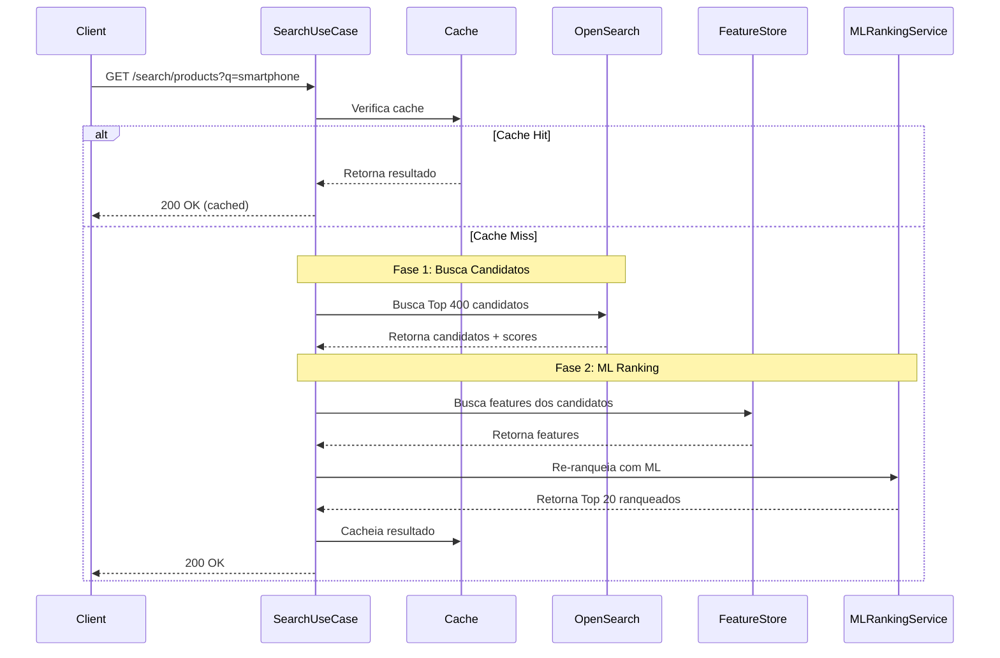

# Search Service

Serviço responsável pela busca de produtos com ranking ML em 2 fases, cache inteligente e integração com serviços ML.

## 📋 Descrição Funcional

O Search Service é responsável por:

- **Busca em 2 Fases**: Top 400 candidatos + ML ranking para Top 20
- **Cache Inteligente**: Redis para consultas frequentes
- **ML Ranking**: Re-ranking com Machine Learning usando 17 features
- **Extração de Features**: Calcula features dinâmicas baseadas na query
- **Filtros e Ordenação**: Suporte a múltiplos filtros e ordenação
- **Paginação**: Suporte a paginação de resultados

## 🏗️ Arquitetura

O Search Service segue **Arquitetura Hexagonal** completa:

```
search-service/
├── domain/              # Camada de Domínio (Core)
│   ├── entities/       # Entidades: Product, Category
│   ├── valueobjects/   # Value Objects: SearchQuery, SearchResult, UserContext
│   ├── repositories/   # Ports: ProductSearchRepository, CacheRepository
│   └── services/       # Domain Services: SearchDomainService, MLRankingService
├── application/         # Camada de Aplicação
│   ├── usecases/       # Casos de Uso: SearchProductsUseCase, RankWithMLUseCase
│   ├── queries/        # Queries: SearchRequestQuery, SearchResultQuery
│   └── mappers/        # Mappers: SearchMapper
├── infrastructure/     # Camada de Infraestrutura (Adapters)
│   ├── opensearch/    # OpenSearch Repository, Query Builder
│   ├── redis/         # Redis Cache Repository
│   ├── ml/            # ML Service Clients
│   └── config/        # Configurações
├── interfaces/          # Camada de Interfaces
│   └── rest/           # REST Controllers, DTOs
└── bootstrap/          # Camada de Bootstrap
    └── SearchApp.java   # Classe principal
```

## 🔄 Fluxo de Busca em 2 Fases

### Visão Geral

O sistema implementa uma busca em 2 fases para otimizar performance e relevância:

**Fase 1: Busca de Candidatos (Top 400)**
- Busca textual no OpenSearch usando BM25 e k-NN
- Retorna até 400 candidatos com scores de relevância
- Filtros aplicados nesta fase

**Fase 2: ML Ranking (Top 20)**
- Extração de 17 features dos candidatos
- Chamada ao ML Ranking Service para re-ranquear
- Retorno dos Top 20 produtos mais relevantes

### Fluxo Detalhado



## 📦 Componentes Principais

### SearchProductsUseCase

Caso de uso principal para busca de produtos.

**Fluxo:**
1. Verifica cache
2. **Fase 1**: Busca Top 400 candidatos no OpenSearch
3. **Fase 2**: Extrai features, chama ML ranking, retorna Top 20
4. Cacheia resultado

**Implementação:**
```java
public SearchResultQuery execute(SearchRequestQuery request) {
    // Verificar cache
    String cacheKey = buildCacheKey(query, userContext);
    SearchResultQuery cached = getFromCache(cacheKey);
    if (cached != null) return cached;
    
    // FASE 1: Buscar Top 400 candidatos
    CandidatesWithScores candidates = 
        productSearchRepository.searchCandidatesWithScores(query, userContext);
    
    // FASE 2: ML Ranking
    List<Product> rankedProducts = 
        rankWithMLUseCase.rank(candidates.products(), query, userContext, scores);
    
    // Cachear e retornar
    storeInCache(cacheKey, result);
    return result;
}
```

### RankWithMLUseCase

Caso de uso para re-ranking com Machine Learning.

**Responsabilidades:**
- Busca features em cache (Redis)
- Extrai features se não estiverem em cache
- Chama ML Ranking Service
- Re-ranqueia resultados (Top 20)

**Features Utilizadas:**
- Relevância (BM25, k-NN, híbrido)
- Match textual (exact match, term coverage)
- Qualidade do texto
- Contexto (primeira palavra, números, marca, categoria)
- Popularidade (score, qualidade, CTR, vendas)

### SearchDomainService

Serviço de domínio para operações de busca avançada.

**Métodos:**
- `smartSearch`: Busca inteligente com ranking personalizado
- `searchWithFallback`: Busca com fallback automático para termos similares

### ProductSearchRepository

Porta para busca de produtos no OpenSearch.

**Métodos:**
- `searchCandidatesWithScores`: Busca candidatos com scores (Top 400)
- `search`: Busca padrão

## 🔌 Integrações

### OpenSearch

**Configuração:**
```yaml
opensearch:
  host: localhost
  port: 9200
  scheme: http
  index:
    products: products-index
```

**Queries:**
- **BM25**: Busca textual tradicional
- **k-NN**: Busca semântica com embeddings
- **Híbrido**: Combinação de BM25 + k-NN

### Redis (Cache)

**Configuração:**
```yaml
cache:
  enabled: true
  ttl:
    search-results: PT1H  # 1 hora
  key-prefix: search:results:
```

**Estratégia de Cache:**
- Chave baseada em query + filtros + contexto do usuário
- TTL de 1 hora para resultados
- Não cacheia resultados vazios

### ML Ranking Service

**Configuração:**
```yaml
ml:
  ranking:
    service:
      url: http://localhost:8084
      timeout-seconds: 5
      max-retries: 3
      enabled: true
```

**Uso:**
- Re-ranqueia até 400 candidatos
- Retorna Top 20 ranqueados
- Fallback se serviço indisponível

### ML Feature Store (Redis)

**Configuração:**
```yaml
ml:
  feature-store:
    redis-key-prefix: feature:ml:
```

**Uso:**
- Busca features pré-calculadas dos produtos
- Features calculadas durante indexação
- TTL de 1 hora

## 📊 Features ML

### 17 Features Utilizadas

**1. Relevância (3 features):**
- `bm25_score`: Score BM25 normalizado (0-1)
- `knn_score`: Score k-NN normalizado (0-1)
- `hybrid_score`: Score híbrido (BM25 + k-NN)

**2. Match Textual (2 features):**
- `exact_match`: Match exato (0 ou 1)
- `term_coverage`: Cobertura de termos (0-1)

**3. Qualidade do Texto (4 features):**
- `title_length`: Comprimento do título
- `description_length`: Comprimento da descrição
- `title_description_ratio`: Ratio título/descrição (0-1)
- `text_quality_score`: Score de qualidade do texto (0-1)

**4. Contexto (4 features):**
- `first_word_match`: Match da primeira palavra (0 ou 1)
- `has_numbers`: Contém números (0 ou 1)
- `brand_match`: Match de marca (0 ou 1)
- `category_match`: Match de categoria (0 ou 1)

**5. Popularidade (4 features):**
- `popularity_score`: Score de popularidade (0-100)
- `quality_score`: Score de qualidade (0-1)
- `ctr`: Click-through rate (0-1)
- `sales_count_normalized`: Vendas normalizadas (0-1)

## 🚀 Executar

### Desenvolvimento

```bash
# Compilar
mvn clean compile -pl search-service

# Executar
mvn spring-boot:run -pl search-service/bootstrap

# Ou executar JAR
mvn clean package -pl search-service
java -jar search-service/bootstrap/target/bootstrap-*.jar
```

### Configuração

```yaml
spring:
  application:
    name: search-service
  data:
    redis:
      host: localhost
      port: 6379

opensearch:
  host: localhost
  port: 9200
  index:
    products: products-index

ml:
  ranking:
    service:
      url: http://localhost:8084
  feature-store:
    redis-key-prefix: feature:ml:

cache:
  enabled: true
  ttl:
    search-results: PT1H
```

## 📡 API REST

### Buscar Produtos

```http
GET /api/v1/search/products?query=smartphone&categoryId=eletronicos&page=0&size=20&sortBy=relevance
```

**Query Parameters:**
- `query` (obrigatório): Termo de busca
- `categoryId` (opcional): ID da categoria
- `brand` (opcional): Marca do produto
- `minPrice` (opcional): Preço mínimo
- `maxPrice` (opcional): Preço máximo
- `condition` (opcional): Condição do produto
- `sellerId` (opcional): ID do vendedor
- `page` (padrão: 0): Número da página
- `size` (padrão: 20, máx: 100): Tamanho da página
- `sortBy` (padrão: relevance): Campo de ordenação
- `sortDirection` (padrão: desc): Direção da ordenação
- `userId` (opcional): ID do usuário para personalização

**Resposta:**
```json
{
  "products": [...],
  "totalCount": 156,
  "pageSize": 20,
  "pageNumber": 0,
  "totalPages": 8,
  "hasNextPage": true,
  "hasPreviousPage": false,
  "executionTimeMs": 45,
  "metrics": {
    "queriesPerSecond": 100,
    "usedCache": false
  }
}
```

### Obter Sugestões

```http
GET /api/v1/search/suggestions?term=smart&limit=10
```

## 📊 Monitoramento

### Actuator Endpoints

- **Health**: http://localhost:8083/api/v1/actuator/health
- **Metrics**: http://localhost:8083/api/v1/actuator/metrics
- **Prometheus**: http://localhost:8083/api/v1/actuator/prometheus

### Métricas Importantes

- **Search Latency**: Latência de busca (P50, P95, P99)
- **Cache Hit Rate**: Taxa de cache hit (> 80%)
- **ML Ranking Latency**: Latência do ML ranking
- **OpenSearch Latency**: Latência do OpenSearch
- **Throughput**: Requisições por segundo

### Benchmarks Esperados

- **Busca Simples**: < 50ms (P95)
- **Busca Complexa**: < 200ms (P95)
- **Cache Hit Rate**: > 80%
- **ML Ranking**: < 50ms (P95)

## 🔄 Fluxo Completo

### Exemplo: Busca "smartphone samsung"

1. **Verificação de Cache**
   - Chave: `search:results:mode=standard:q=smartphone samsung:...`
   - Se cache hit, retorna imediatamente

2. **Fase 1: Busca Candidatos**
   - Query OpenSearch: BM25 + k-NN para "smartphone samsung"
   - Filtros: categoria, preço, etc.
   - Retorna Top 400 candidatos com scores

3. **Fase 2: ML Ranking**
   - Busca features dos 400 candidatos no Redis
   - Calcula features dinâmicas (BM25, k-NN, match textual)
   - Chama ML Ranking Service com 17 features
   - Recebe Top 20 ranqueados

4. **Cache e Retorno**
   - Cacheia resultado por 1 hora
   - Retorna Top 20 produtos

## 🎯 Próximos Passos

- [ ] Implementar busca com fallback automático
- [ ] Adicionar personalização baseada em histórico
- [ ] Implementar A/B testing de relevância
- [ ] Adicionar métricas de conversão
- [ ] Implementar busca por voz
- [ ] Adicionar filtros avançados
- [ ] Implementar busca por imagem

